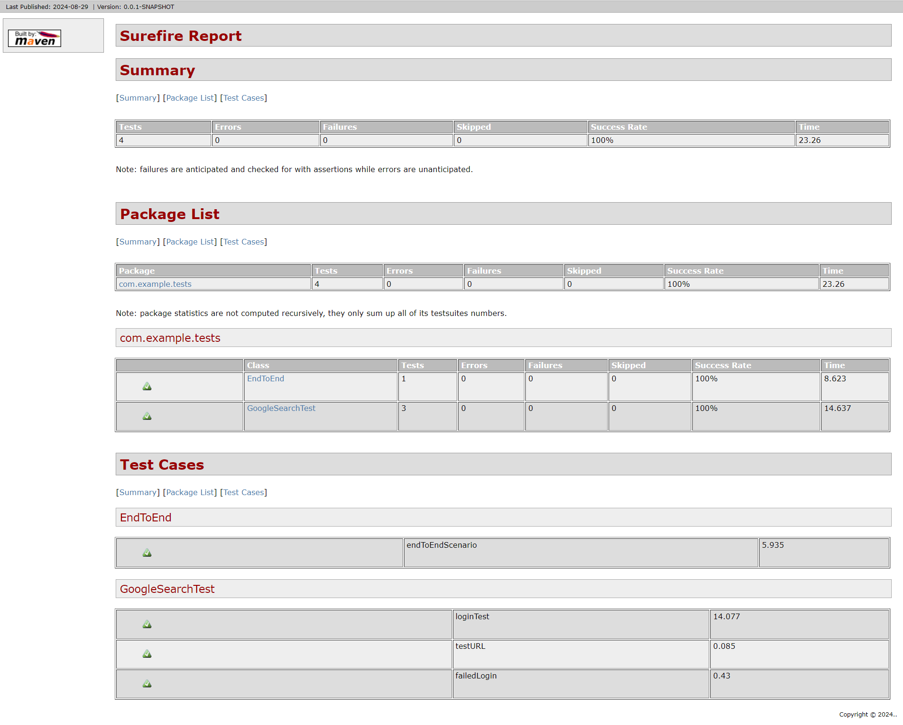
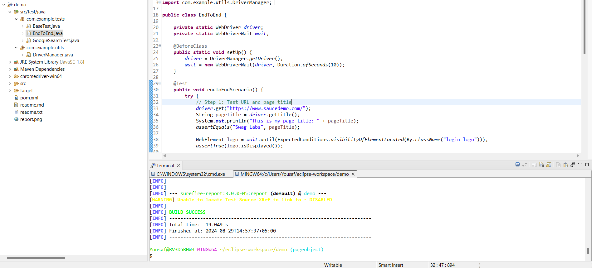

# Demo Project

This is a demo Maven project configured with Selenium for browser automation, JUnit for testing, and Logback for logging.

## Project Details

- **Group ID**: `com.ytest`
- **Artifact ID**: `demo`
- **Version**: `0.0.1-SNAPSHOT`

## Dependencies

- **Selenium Java**: For browser automation.
- **JUnit**: For unit testing (scope: test).
- **Logback**: For logging.

## Build Configuration

The project uses Maven for building and testing. The build configuration includes:

- **maven-surefire-plugin**: For running tests.
- **maven-surefire-report-plugin**: For generating test reports.

## How to Build and Test

1. **Build the Project**: Run `mvn clean install` to build the project and install dependencies.
2. **Run Tests**: Use `mvn test` to execute tests. Test reports will be generated automatically.


## How to Run the Project

Before running the project, ensure the following:

- **Maven**: Maven is installed, and its path is included in your environment variables.
- **ChromeDriver**: Ensure the ChromeDriver executable is correctly set up and its path is specified in your test configurations.

### Steps to Execute Tests

1. **Verify Dependencies**:
   - Check the `pom.xml` file for all dependencies used in the project.

2. **Run Tests**:
   - Execute the following command to run all test cases:
     ```bash
     mvn test
     ```

3. **Generate Test Report**:
   - The `maven-surefire-report-plugin` is configured to generate test reports. To create a report, run:
     ```bash
     mvn surefire-report:report
     ```
   - This will generate a report in the `target/site` directory. Note that the `target` directory is added to `.gitignore`, so it will not be visible in the GitHub repository.

4. **Generate HTML Report**:
   - To generate an HTML report, use the following command:
     ```bash
     mvn test site -P test-report
     ```

5. **Run Specific Tests**:
   - To run a specific test class or file, use:
     ```bash
     mvn -Dtest=EndToEnd test
     ```
   - Replace `EndToEnd` with the name of the test class you want to execute.

By following these steps, you can run tests, generate reports, and execute specific test classes as needed.


## Contributing

Contributions are welcome! Please fork the repository, make your changes, and submit a pull request.


## Screenshots





